# Smart Photo Album
(My Youtube Video Demo)
https://www.youtube.com/watch?v=xSYp1JsPXb8

### Architecture Diagram

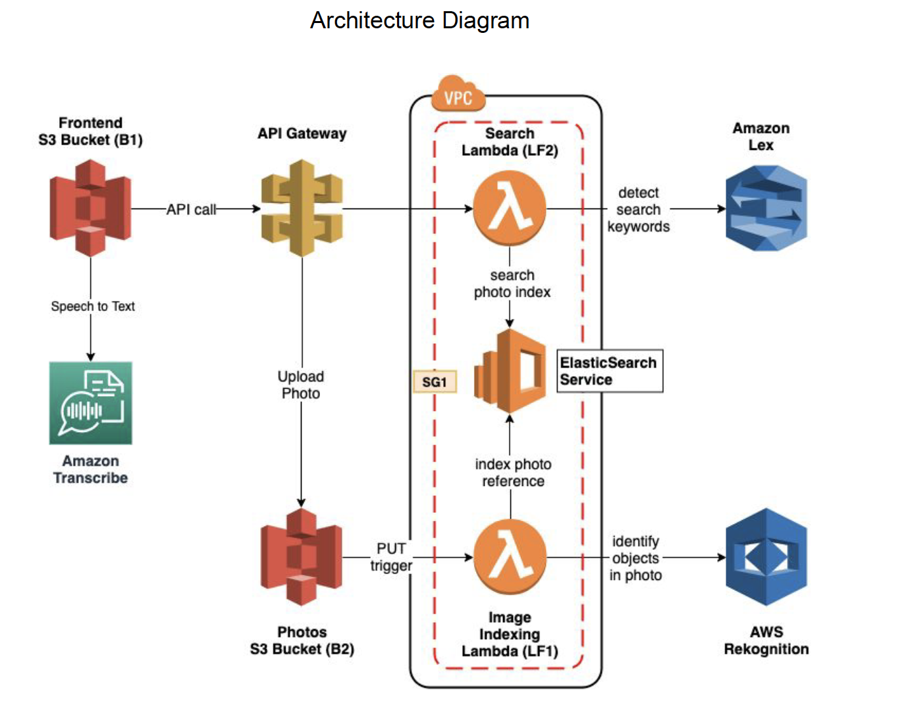

### Introduction

This event-driven serverless Smart Photo Album allows users to upload photos to their album, and also search for photos using natural language through either voice. My implementation enables intelligent search layer to query users' searching (people, animals, objects, actions, landmarks, etc.).

This project involves a lot of AWS micro-service components such as Amazon LEX (for natural lanaguage queries processing), Amazon Virtual Private Cloud (VPC), Amazon Rekognition, ElasticSearch Services, Amazon Transcribe, Amazon Lambda backend functions, etc. This project orchestrates all these components to stand up the entire web app.

 

 

This is what my front-end looks like

It has 2 major components: 

1. uploading a photo to my AWS S3 photo-gallery-bucket

2. searching for photos with user-defined criteria

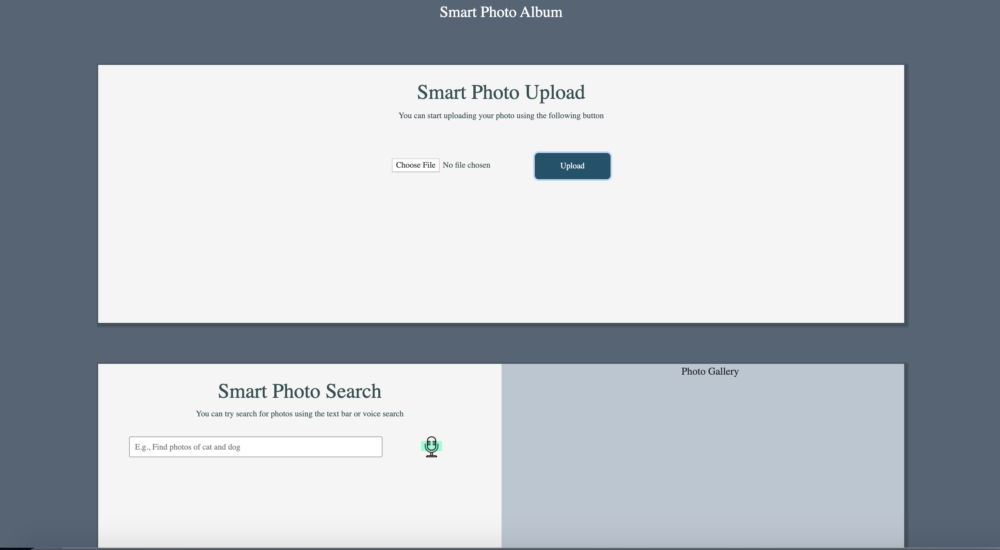

 

---

 

I have defined my APIs on a YAML file, which then can be imported onto AWS API Gateway to modify or fine tune what other settings need to be done there

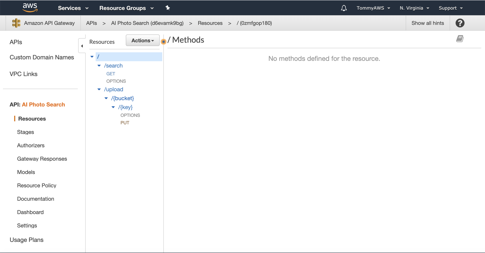

 

After deploying the API (note that I have enabled CORS on AWS API Gateway for cross-domain interactions), the API is ready to use.

 

---

 

An interesting part about this project is that I have hosted everything onto my Virtual Private Cloud (VPC) for better monitoring, access and control

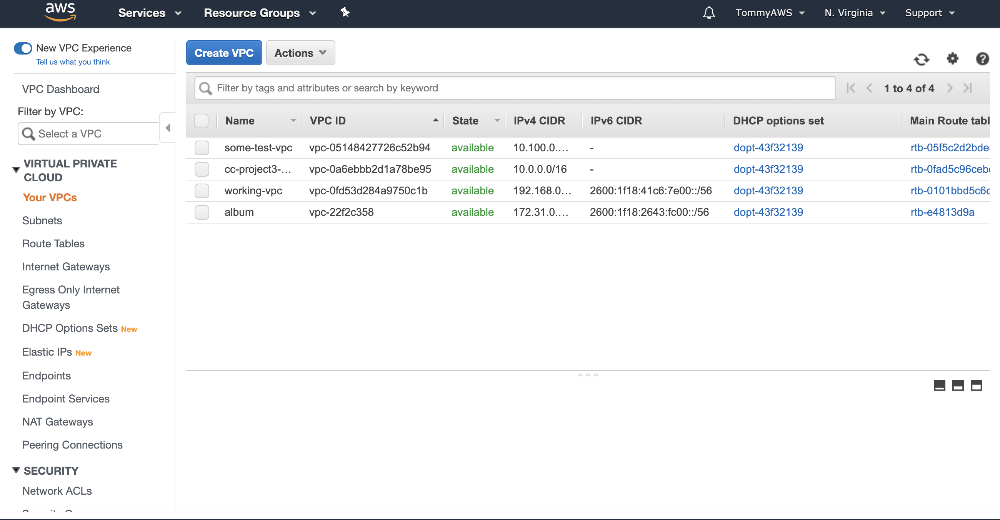

 

In order to enable AWS cross-services and public-to-private interactions, I need to create a few subnets 

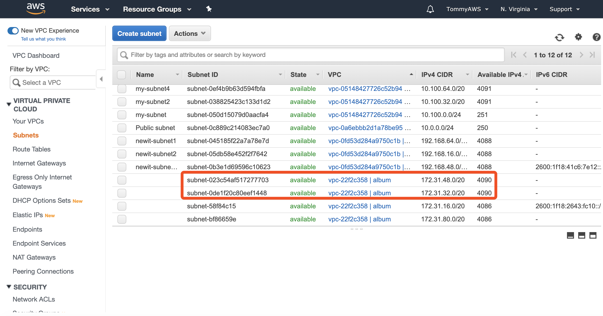

 

In addition, to enable some services to run inside my VPC, I need to open up a few endpoitns. Note that I have added AWS Rekognition because I need to use this powerful services to operate AI analysis on any photo I upload and label the photo with some features that it carries

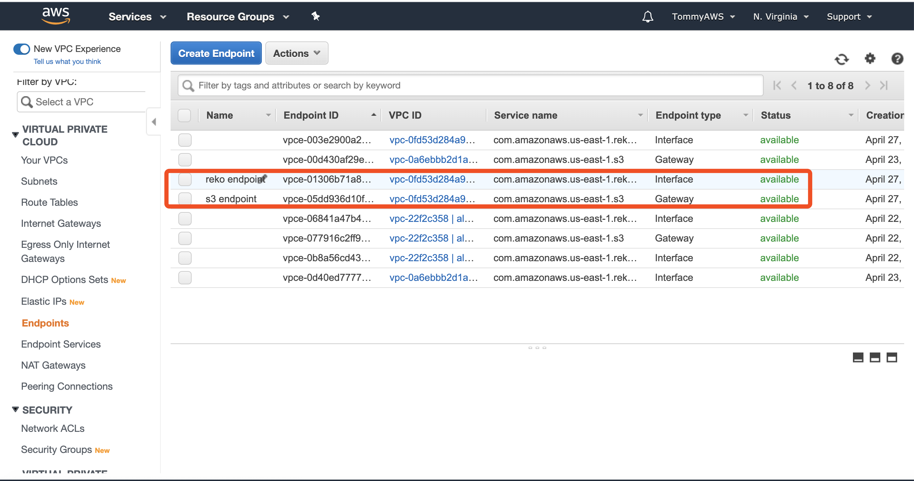

 

Also, a few other components need to be updated in order to have a more well-defined VPC used for my project, including route tables, internet gateways, NAT gateways, ACLs, etc.

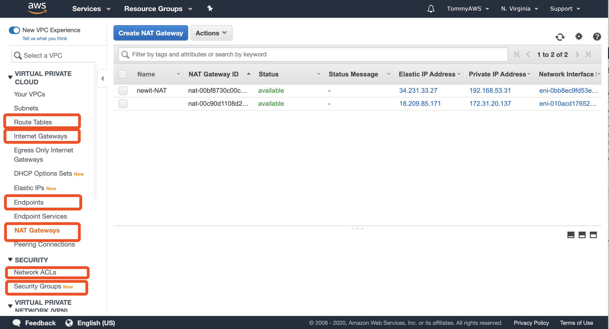

 

---

 

For searching for photos, a very friendly service AWS provides is ElasticSearch Services (ES). Since I have my VPC ready, it's better to host my ES there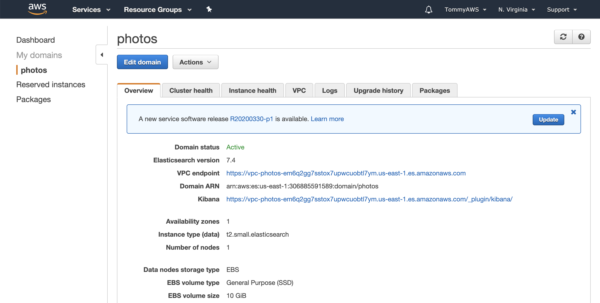

 

---

 

To upload a photo to my AWS S3 photo gallery, I can randomly pick anything to upload

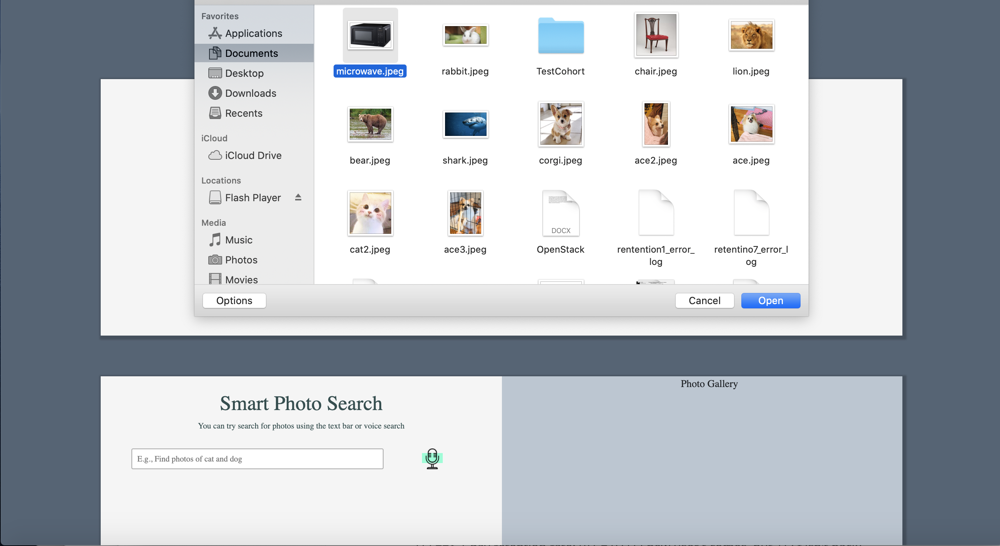

 

I have set a S3 bucket PUT trigger, which waits for any photo uploads to the bucket and then trigger my lambda function, which uses AWS Rekogniton to label my picture

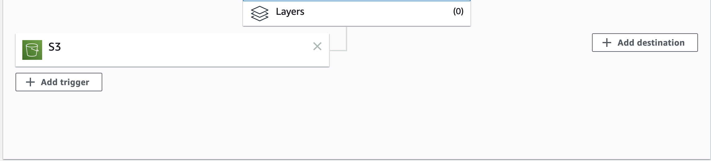

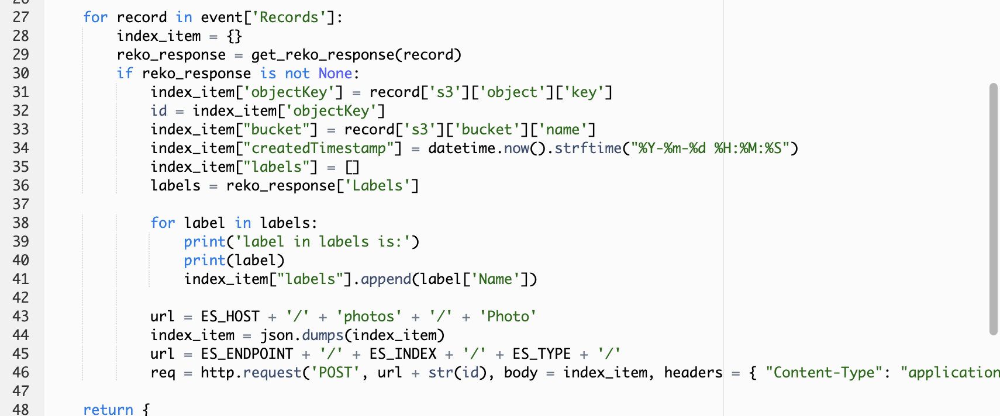

 

Apparently, the labels that AWS Rekognition that my lambda function invokes for my microwave picture are something like: Appliance, Oven, Microwave

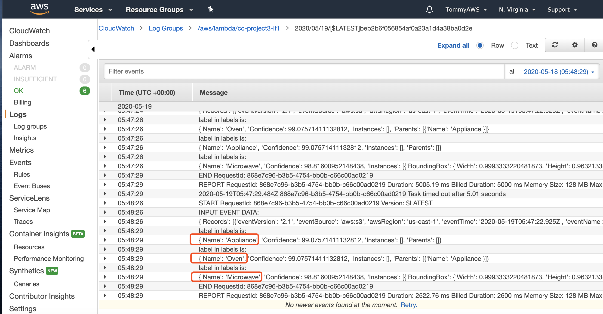

 

---

 

In order to search for photos, simply type or speak (yes, I have also incorporated voice input here) the utterances for AWS Lex to pick up, and extract the keywords that match the labels as my ElasticSearch index to search for the photos.

Particularly, Amazon Lex first extract the keywords from input utterances, and invoke my search-lambda-function 

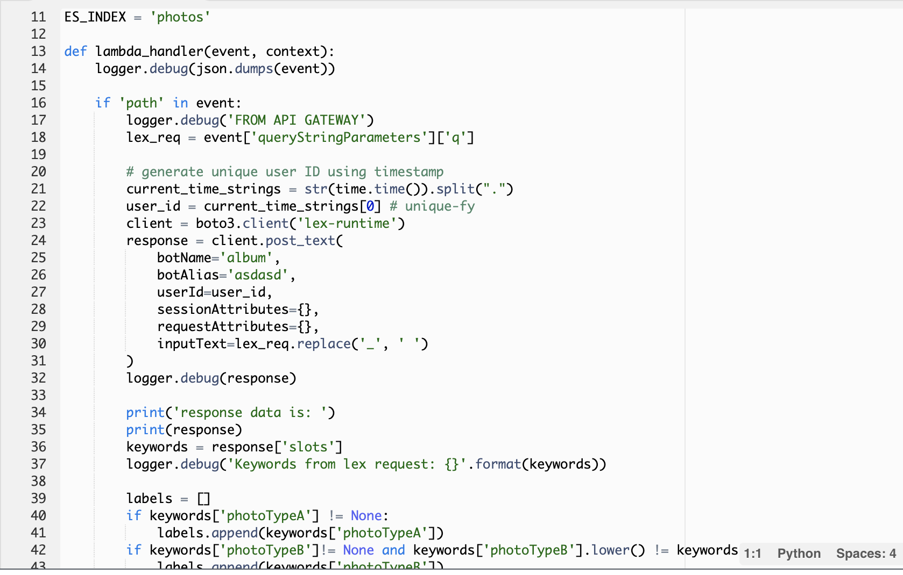

 

My lambda function uses the extracted labels, send the request to my ElasticSearch Services with these labels as indices, and fetch photos from after  my AWS S3 photo-gallery 

(Note that I have set quite a few utterances sample for training AWS Lex to learn some possible input types in order to extract the keyword, such as "cat" and "dog" provided with the input "show me cat and dog")

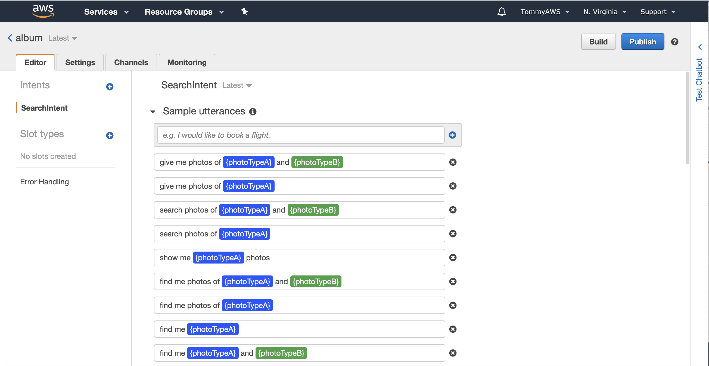

 

 

After all the paths from here to there, some nice pictures with the matched labeled fetched by my search-lambda-function will be pushed onto my backend, which then hands over to my frontEnd to present

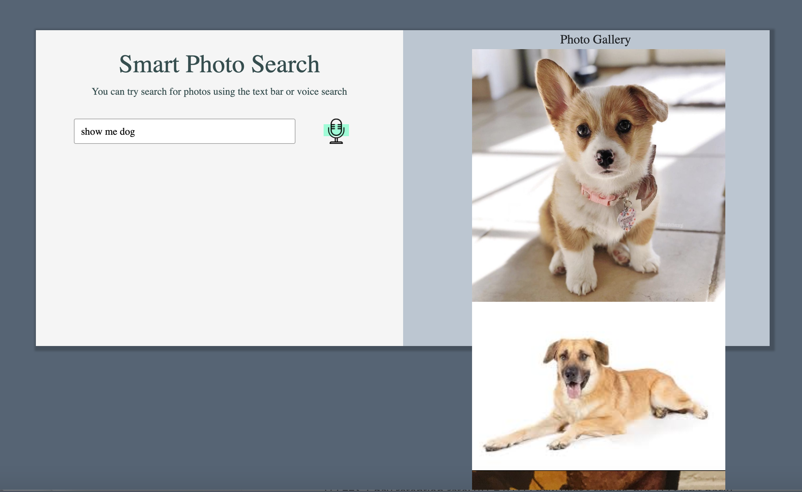

 

---

 

Finally, in order to stand up the entire projects, I have deployed and pipelined each components of this project onto AWS Cloudformation so that with a template, well defined lambda backend codes, and beautifuly crafted frontend codes, such project can be easily replicated

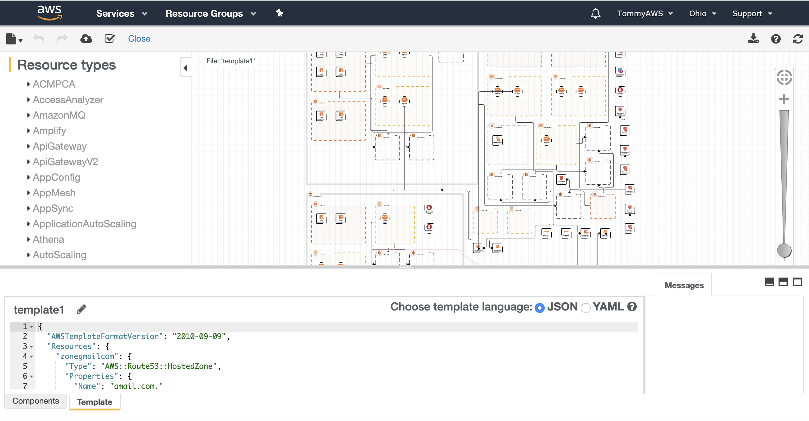

